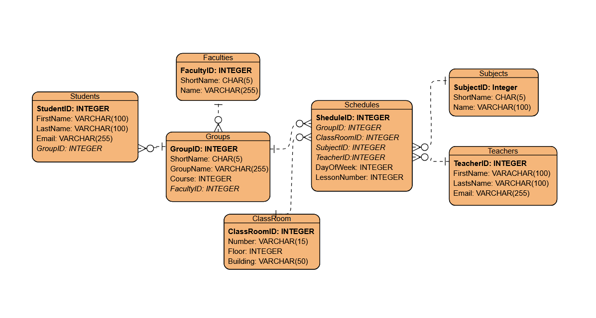

# Проектирование Базы Данных для Системы Высшего Образования

## Part 1: Выбор Сценария

Для данной работы выбран сценарий: **Система высшего образования**. Эта система будет управлять студентами, их предметами и расписанием, группами, в которых они находятся, преподавателями. Данная система была выбрана, так как я являюсь учащимся и могу более качественно спроектировать базу данных.

---

## Part 2: Проектирование Базы Данных и Документация

### 1. Идентификация Сущностей и Атрибутов

1. **Студенты (Students)** — хранит информацию о студентах.
2. **Преподаватели (Teachers)** — хранит информацию о преподавателях.
3. **Группы (Groups)** — для заполнения расписания по группам.
4. **Факультет (Faculties)** — для удобного поиска групп.
5. **Предметы (Subjects)** — список дисциплин.
6. **Аудитория (Classrooms)** — для удобного доступа к расписанию.
7. **Расписание (Schedules)** — связывает все сущности.

---

### 2. Проектирование Таблиц

#### 2.1. Таблица `Students`

- **Описание:** Хранит информацию о студентах.
- **Атрибуты:**
  - `StudentID` — `INTEGER`, **PK**, `NOT NULL`, `UNIQUE`
  - `FirstName` — `VARCHAR(100)`, `NOT NULL`
  - `LastName` — `VARCHAR(100)`, `NOT NULL`
  - `Email` — `VARCHAR(255)`, `UNIQUE`
  - `GroupID` — `INTEGER`, **FK** (ссылается на `Groups`)

- **Ограничения:**
  - `PK_Students`: `PRIMARY KEY (StudentID)`
  - `UQ_Email`: `UNIQUE (Email)`
  - `FK_Students_Groups`: `FOREIGN KEY (GroupID) REFERENCES Groups(GroupID)`

---

#### 2.2. Таблица `Teachers`

- **Описание:** Хранит информацию о преподавателях.
- **Атрибуты:**
  - `TeacherID` — `INTEGER`, **PK**, `NOT NULL`, `UNIQUE`
  - `FirstName` — `VARCHAR(100)`, `NOT NULL`
  - `LastName` — `VARCHAR(100)`, `NOT NULL`
  - `Email` — `VARCHAR(255)`, `UNIQUE`

- **Ограничения:**
  - `PK_Teachers`: `PRIMARY KEY (TeacherID)`
  - `UQ_Email`: `UNIQUE (Email)`

---

#### 2.3. Таблица `Groups`

- **Описание:** Содержит информацию о группах.
- **Атрибуты:**
  - `GroupID` — `INTEGER`, **PK**, `NOT NULL`, `UNIQUE`
  - `ShortName` — `CHAR(5)`, `NOT NULL`, `UNIQUE`
  - `GroupName` — `VARCHAR(255)`, `NOT NULL`, `UNIQUE`
  - `Course` — `INTEGER`, `NOT NULL`
  - `FacultyID` — `INTEGER`, **FK** (ссылается на `Faculties`), `NOT NULL`

- **Ограничения:**
  - `PK_Groups`: `PRIMARY KEY (GroupID)`
  - `UQ_ShortName`: `UNIQUE (ShortName)`
  - `UQ_GroupName`: `UNIQUE (GroupName)`
  - `CHK_Course`: `CHECK (Course >= 1 AND Course <= 5)`
  - `FK_Groups_Faculties`: `FOREIGN KEY (FacultyID) REFERENCES Faculties(FacultyID)`

---

#### 2.4. Таблица `Faculties`

- **Описание:** Содержит информацию о факультетах.
- **Атрибуты:**
  - `FacultyID` — `INTEGER`, **PK**, `NOT NULL`, `UNIQUE`
  - `ShortName` — `CHAR(5)`, `NOT NULL`, `UNIQUE`
  - `Name` — `VARCHAR(100)`, `NOT NULL`, `UNIQUE`

- **Ограничения:**
  - `PK_Faculties`: `PRIMARY KEY (FacultyID)`
  - `UQ_ShortName`: `UNIQUE (ShortName)`
  - `UQ_Name`: `UNIQUE (Name)`

---

#### 2.5. Таблица `Subjects`

- **Описание:** Содержит информацию о предметах.
- **Атрибуты:**
  - `SubjectID` — `INTEGER`, **PK**, `NOT NULL`, `UNIQUE`
  - `ShortName` — `CHAR(5)`, `NOT NULL`
  - `Name` — `VARCHAR(100)`, `NOT NULL`

- **Ограничения:**
  - `PK_Subjects`: `PRIMARY KEY (SubjectID)`

---

#### 2.6. Таблица `Classrooms`

- **Описание:** Содержит информацию об аудиториях.
- **Атрибуты:**
  - `ClassroomID` — `INTEGER`, **PK**, `NOT NULL`, `UNIQUE`
  - `Number` — `VARCHAR(15)`, `NOT NULL`, `UNIQUE`
  - `Floor` — `INTEGER`
  - `Building` — `VARCHAR(50)`

- **Ограничения:**
  - `PK_Classrooms`: `PRIMARY KEY (ClassroomID)`
  - `UQ_Number`: `UNIQUE (Number)`

---

#### 2.7. Таблица `Schedules`

- **Описание:** Таблица для реализации связи "многие-ко-многим". Показывает информацию о парах: для каких групп проводится, каким преподавателем, в какой аудитории и в какое время.
- **Атрибуты:**
  - `ScheduleID` — `INTEGER`, **PK**, `NOT NULL`, `UNIQUE`
  - `GroupID` — `INTEGER`, **FK** (ссылается на `Groups`), `NOT NULL`
  - `ClassroomID` — `INTEGER`, **FK** (ссылается на `Classrooms`), `NOT NULL`
  - `SubjectID` — `INTEGER`, **FK** (ссылается на `Subjects`), `NOT NULL`
  - `TeacherID` — `INTEGER`, **FK** (ссылается на `Teachers`), `NOT NULL`
  - `DayOfWeek` — `INTEGER`, `NOT NULL` (1 = Понедельник, ..., 7 = Воскресенье)
  - `LessonNumber` — `INTEGER`, `NOT NULL` (номер пары)

- **Ограничения:**
  - `PK_Schedules`: `PRIMARY KEY (ScheduleID)`
  - `FK_Schedules_Groups`: `FOREIGN KEY (GroupID) REFERENCES Groups(GroupID)`
  - `FK_Schedules_Classrooms`: `FOREIGN KEY (ClassroomID) REFERENCES Classrooms(ClassroomID)`
  - `FK_Schedules_Subjects`: `FOREIGN KEY (SubjectID) REFERENCES Subjects(SubjectID)`
  - `FK_Schedules_Teachers`: `FOREIGN KEY (TeacherID) REFERENCES Teachers(TeacherID)`
  - `CHK_DayOfWeek`: `CHECK (DayOfWeek >= 1 AND DayOfWeek <= 7)`
  - `CHK_LessonNumber`: `CHECK (LessonNumber >= 1 AND LessonNumber <= 8)`
  - `UQ_GroupSlot`: `UNIQUE (GroupID, DayOfWeek, LessonNumber)` — одна группа не может иметь две пары одновременно
  - `UQ_TeacherSlot`: `UNIQUE (TeacherID, DayOfWeek, LessonNumber)` — преподаватель не может вести две пары одновременно
  - `UQ_ClassroomSlot`: `UNIQUE (ClassroomID, DayOfWeek, LessonNumber)` — аудитория не может быть занята дважды одновременно

---

### 3. Взаимосвязи (Связи между таблицами)

| Связь | Тип | Описание |
| :--- | :--- | :--- |
| **Students ↔ Groups** | **Один-ко-Многим** | Одной группе может принадлежать множество студентов, но каждый студент принадлежит **только одной группе**.   `Students.GroupID` → `Groups.GroupID` |
| **Groups ↔ Faculties** | **Один-ко-Многим** | Факультет может содержать много групп, но одна группа принадлежит **только одному факультету**.   `Groups.FacultyID` → `Faculties.FacultyID` |
| **Schedules ↔ (Groups, Classrooms, Subjects, Teachers)** | **Многие-ко-Многим** (через промежуточную таблицу) | Каждое занятие связывает **одну группу, один предмет, одну аудиторию и одного преподавателя**.   `Schedules.GroupID` → `Groups.GroupID`   `Schedules.ClassroomID` → `Classrooms.ClassroomID`   `Schedules.SubjectID` → `Subjects.SubjectID`   `Schedules.TeacherID` → `Teachers.TeacherID` |

---

## Part 3: ER-Диаграмма

Ниже представлена ER-диаграмма для данной базы данных. Она показывает все сущности, их атрибуты и связи между ними.

---

