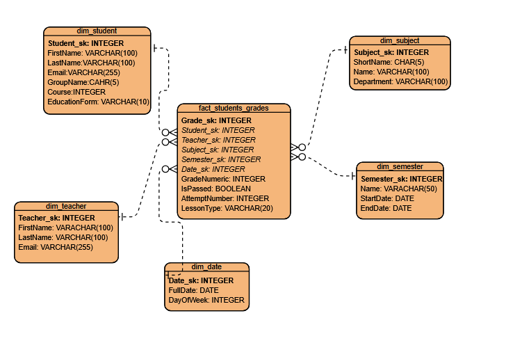

# Проектирование Data Warehouse для системы высшего образования

## Part 1: Выбор бизнес-области

Для данной работы выбран сценарий: **Система высшего образования**. Эта область была выбрана по прошлой работе (номер 2). Я решил не брать старую базу, а сделать новую моделью данных Star, так как прошлую БД пришлось бы переделывать и запросы в ней были бы сложней. Но их всегда можно совместить.

**Бизнес-область:** успеваемость студентов, фиксация результатов каждой сдачи дисциплины и их пересдачи.

**Уровень детализации (Grain):** одна запись -- это одна попытка сдачи по предмету в какую-то дату.

---

## Part 2: Таблицы измерений и фактов

### Идентификация Измерений:

1. Студент (dim_student)
2. Преподаватель (dim_teacher)
3. Предмет (dim_subject)
4. Семестр (dim_semester)
5. Дата (dim_date)

Были взяты эти измерения, потому что они лучше всего подходят для ответа об успеваемости. Потому что на успеваемость влияют предмет и преподаватель в большей своей части, также группа, но я её не выносил отдельной таблицей и оставил в таблице dim_student, для того чтобы не усложнять схему. Таблицы с семестром и датой служат для сохранения истории.

### Проектирование Таблиц:

#### 1. Table Name: dim_student

**Description:** Хранит информацию о студентах.

**Attributes:**
- Student_sk: INTEGER, PK, NOT NULL, UNIQUE
- FirstName: VARCHAR(100), NOT NULL
- LastName: VARCHAR(100), NOT NULL
- Email: VARCHAR(255), UNIQUE
- GroupName: CHAR(5), NOT NULL
- Course: INTEGER, NOT NULL
- EducationForm: VARCHAR(10), NOT NULL

**Constraints:**
- PK_dim_student: PRIMARY KEY (Student_sk)
- UQ_Email: UNIQUE (Email)
- CHK_Course: CHECK (Course >= 1 AND Course <= 5)

#### 2. Table Name: dim_teacher

**Description:** Хранит информацию о преподавателях.

**Attributes:**
- Teacher_sk: INTEGER, PK, NOT NULL, UNIQUE
- FirstName: VARCHAR(100), NOT NULL
- LastName: VARCHAR(100), NOT NULL
- Email: VARCHAR(255), UNIQUE

**Constraints:**
- PK_dim_teacher: PRIMARY KEY (Teacher_sk)
- UQ_Email: UNIQUE (Email)

#### 3. Table Name: dim_subject

**Description:** Содержит информацию о предметах.

**Attributes:**
- Subject_sk: INTEGER, PK, NOT NULL, UNIQUE
- ShortName: CHAR(5), NOT NULL
- Name: VARCHAR(100), NOT NULL
- Department: VARCHAR(100), NOT NULL

**Constraints:**
- PK_dim_subject: PRIMARY KEY (Subject_sk)

#### 4. Table Name: dim_semester

**Description:** Содержит информацию о семестрах.

**Attributes:**
- Semester_sk: INTEGER, PK, NOT NULL, UNIQUE
- Name: VARCHAR(50), NOT NULL
- StartDate: DATE, NOT NULL
- EndDate: DATE, NOT NULL

**Constraints:**
- PK_dim_semester: PRIMARY KEY (Semester_sk)

#### 5. Table Name: dim_date

**Description:** Содержит информацию о датах проведения экзамена.

**Attributes:**
- Date_sk: INTEGER, PK
- FullDate: DATE, NOT NULL
- DayOfWeek: INTEGER, NOT NULL

**Constraints:**
- PK_dim_date: PRIMARY KEY (Date_sk)
- CHK_DayOfWeek: CHECK (DayOfWeek >= 1 AND DayOfWeek <= 7)

### Идентификация Фактов:

#### 1. Оценки студентов (fact_students_grades)

**Атрибуты, описывающие событие:**
- Grade_sk - первичный ключ
- Student_sk - Ссылка на студента
- Teacher_sk - Ссылка на преподавателя, принявшего экзамен
- Subject_sk - Ссылка на дисциплину
- Semester_sk - Семестр, в котором проходила сдача
- Date_sk - Дата проведения экзамена (или дата пересдачи)
- LessonType - Тип контроля: экзамен, зачёт, курсовая

**Показатели для анализа:**
- GradeNumeric - Оценка (0-10), используется для экзаменов и курсовых, для зачёта NULL
- IsPassed - Флаг сдачи (1 - сдал, 0 - не сдал), используется для зачётов и как обобщённый показатель успешности
- AttemptNumber - Номер попытки (1, 2, 3...)

### Проектирование Таблиц:

#### Table Name: fact_students_grades

**Description:** содержит внешние ключи на все измерения и числовые метрики.

**Attributes:**
- Grade_sk: INTEGER, PK, NOT NULL, UNIQUE
- Student_sk: INTEGER, FK (REFERENCES dim_student), NOT NULL
- Teacher_sk: INTEGER, FK (REFERENCES dim_teacher), NOT NULL
- Subject_sk: INTEGER, FK (REFERENCES dim_subject), NOT NULL
- Semester_sk: INTEGER, FK (REFERENCES dim_semester), NOT NULL
- Date_sk: INTEGER, FK (REFERENCES dim_date), NOT NULL
- LessonType: VARCHAR(20), NOT NULL
- GradeNumeric: INTEGER, NULL
- AttemptNumber: INTEGER, NOT NULL
- IsPassed: BOOLEAN, NOT NULL

**Constraints:**
- PK_fact_students_grades: PRIMARY KEY (Grade_sk)
- FK_fact_students_grades_dim_student: FOREIGN KEY (Student_sk) REFERENCES dim_student(Student_sk)
- FK_fact_students_grades_dim_subject: FOREIGN KEY (Subject_sk) REFERENCES dim_subject(Subject_sk)
- FK_fact_students_grades_dim_teacher: FOREIGN KEY (Teacher_sk) REFERENCES dim_teacher(Teacher_sk)
- FK_fact_students_grades_dim_date: FOREIGN KEY (Date_sk) REFERENCES dim_date(Date_sk)
- CHK_GradeNumeric: CHECK (GradeNumeric IS NULL OR (GradeNumeric >= 0 AND GradeNumeric <= 10))

---

## Part 3: ER-Диаграмма



---

## Part 4: Аналитические SQL-запросы

### Запрос 1. Средний балл студентов по курсам (по экзаменам)

```sql
SELECT
    s.Course,
    AVG(f.GradeNumeric) AS AvgGrade
FROM fact_students_grades f
JOIN dim_student s ON f.Student_sk = s.Student_sk
WHERE f.LessonType = 'Экзамен' AND f.GradeNumeric IS NOT NULL
GROUP BY s.Course
ORDER BY s.Course;
```

---

### Запрос 2. Количество пересдач по предметам

```sql
SELECT 
    sub.ShortName,
    sub.Name,
    COUNT(*) AS TotalRetakes,
    AVG(f.AttemptNumber) AS AvgAttempts
FROM fact_students_grades f
JOIN dim_subject sub ON f.Subject_sk = sub.Subject_sk
WHERE f.AttemptNumber > 1
GROUP BY sub.ShortName, sub.Name
ORDER BY TotalRetakes DESC;
```

---

### Запрос 3. Успеваемость по преподавателям (процент сдавших с первой попытки)

```sql
SELECT 
    t.LastName,
    t.FirstName,
    COUNT(*) AS TotalExams,
    SUM(CASE WHEN f.AttemptNumber = 1 AND f.IsPassed = TRUE THEN 1 ELSE 0 END) AS PassedFirstTry,
    ROUND(100.0 * SUM(CASE WHEN f.AttemptNumber = 1 AND f.IsPassed = TRUE THEN 1 ELSE 0 END) / COUNT(*), 2) AS PassRatePercent
FROM fact_students_grades f
JOIN dim_teacher t ON f.Teacher_sk = t.Teacher_sk
WHERE f.LessonType IN ('Экзамен', 'Зачёт')
GROUP BY t.LastName, t.FirstName
HAVING COUNT(*) >= 5
ORDER BY PassRatePercent DESC;
```

---

### Запрос 5. Студенты с наибольшим количеством пересдач

```sql
SELECT 
    s.LastName,
    s.FirstName,
    s.GroupName,
    COUNT(*) AS TotalAttempts,
    SUM(CASE WHEN f.IsPassed = FALSE THEN 1 ELSE 0 END) AS FailCount,
    MAX(f.AttemptNumber) AS MaxAttempt
FROM fact_students_grades f
JOIN dim_student s ON f.Student_sk = s.Student_sk
GROUP BY s.LastName, s.FirstName, s.GroupName
HAVING COUNT(*) > 1
ORDER BY FailCount DESC, MaxAttempt DESC
LIMIT 10;
```

---

## Приложение 1 (Для теста)

### Создание таблиц

```sql
CREATE TABLE dim_student (
    Student_sk     INTEGER PRIMARY KEY,
    FirstName      VARCHAR(100) NOT NULL,
    LastName       VARCHAR(100) NOT NULL,
    Email          VARCHAR(255) UNIQUE,
    GroupName      CHAR(5) NOT NULL,
    Course         INTEGER NOT NULL CHECK (Course BETWEEN 1 AND 5),
    EducationForm  VARCHAR(10) NOT NULL
);

CREATE TABLE dim_teacher (
    Teacher_sk     INTEGER PRIMARY KEY,
    FirstName      VARCHAR(100) NOT NULL,
    LastName       VARCHAR(100) NOT NULL,
    Email          VARCHAR(255) UNIQUE
);

CREATE TABLE dim_subject (
    Subject_sk     INTEGER PRIMARY KEY,
    ShortName      CHAR(5) NOT NULL,
    Name           VARCHAR(100) NOT NULL,
    Department     VARCHAR(100) NOT NULL
);

CREATE TABLE dim_semester (
    Semester_sk    INTEGER PRIMARY KEY,
    Name           VARCHAR(50) NOT NULL,
    StartDate      DATE NOT NULL,
    EndDate        DATE NOT NULL
);

CREATE TABLE dim_date (
    Date_sk        INTEGER PRIMARY KEY,
    FullDate       DATE NOT NULL,
    DayOfWeek      INTEGER NOT NULL CHECK (DayOfWeek BETWEEN 1 AND 7)
);

CREATE TABLE fact_students_grades (
    Grade_sk       INTEGER PRIMARY KEY,
    Student_sk     INTEGER NOT NULL REFERENCES dim_student(Student_sk),
    Teacher_sk     INTEGER NOT NULL REFERENCES dim_teacher(Teacher_sk),
    Subject_sk     INTEGER NOT NULL REFERENCES dim_subject(Subject_sk),
    Semester_sk    INTEGER NOT NULL REFERENCES dim_semester(Semester_sk),
    Date_sk        INTEGER NOT NULL REFERENCES dim_date(Date_sk),
    LessonType     VARCHAR(20) NOT NULL CHECK (LessonType IN ('Экзамен', 'Зачёт', 'Курсовая')),
    GradeNumeric   INTEGER CHECK (GradeNumeric IS NULL OR (GradeNumeric BETWEEN 0 AND 10)),
    AttemptNumber  INTEGER NOT NULL CHECK (AttemptNumber >= 1),
    IsPassed       BOOLEAN NOT NULL
);
```

---

### Вставка тестовых данных

#### Студенты

```sql
INSERT INTO dim_student VALUES
(1, 'Иван', 'Петров', 'ivan.petrov@edu.ru', 'А-101', 1, 'Очная'),
(2, 'Мария', 'Сидорова', 'maria.sidorova@edu.ru', 'А-101', 1, 'Очная'),
(3, 'Алексей', 'Смирнов', 'alexey.smirnov@edu.ru', 'Б-202', 2, 'Очная'),
(4, 'Екатерина', 'Кузнецова', 'ekaterina.k@edu.ru', 'Б-202', 2, 'Очная'),
(5, 'Дмитрий', 'Попов', 'dmitry.popov@edu.ru', 'В-303', 3, 'Заочная'),
(6, 'Анна', 'Васильева', 'anna.vasilieva@edu.ru', 'В-303', 3, 'Заочная'),
(7, 'Сергей', 'Зайцев', 'sergey.zaitsev@edu.ru', 'Г-404', 4, 'Очная'),
(8, 'Ольга', 'Морозова', 'olga.morozova@edu.ru', 'Г-404', 4, 'Очная'),
(9, 'Николай', 'Новиков', 'nikolay.novikov@edu.ru', 'Д-505', 5, 'Очная'),
(10, 'Татьяна', 'Фёдорова', 'tatiana.fedorova@edu.ru', 'Д-505', 5, 'Очная');
```

#### Преподаватели

```sql
INSERT INTO dim_teacher VALUES
(1, 'Александр', 'Иванов', 'a.ivanov@uni.ru'),
(2, 'Елена', 'Петрова', 'e.petrova@uni.ru'),
(3, 'Михаил', 'Соколов', 'm.sokolov@uni.ru'),
(4, 'Наталья', 'Михайлова', 'n.mikhailova@uni.ru');
```

#### Предметы

```sql
INSERT INTO dim_subject VALUES
(1, 'МАТ', 'Математика', 'Факультет прикладной математики'),
(2, 'ФИЗ', 'Физика', 'Факультет естественных наук'),
(3, 'ПРОГ', 'Программирование', 'Факультет информационных технологий'),
(4, 'БД', 'Базы данных', 'Факультет информационных технологий'),
(5, 'ИСТ', 'История', 'Гуманитарный факультет');
```

#### Семестры

```sql
INSERT INTO dim_semester VALUES
(1, 'Осень 2025', '2025-09-01', '2025-12-31'),
(2, 'Весна 2026', '2026-02-01', '2026-05-31');
```

#### Даты

```sql
INSERT INTO dim_date VALUES
(1, '2025-12-10', 3),
(2, '2025-12-15', 1),
(3, '2026-02-10', 2),
(4, '2026-02-15', 7),
(5, '2026-03-01', 7),
(6, '2026-03-10', 2),
(7, '2026-03-15', 7),
(8, '2026-04-01', 3),
(9, '2026-04-10', 5),
(10, '2026-04-15', 3);
```

#### Оценки студентов

```sql
INSERT INTO fact_students_grades VALUES
-- Иван Петров (студент 1)
(1, 1, 1, 1, 1, 1, 'Экзамен', 8, 1, TRUE),
(2, 1, 2, 2, 1, 2, 'Экзамен', 6, 1, TRUE),
(3, 1, 3, 3, 1, 2, 'Экзамен', 5, 1, TRUE),
(4, 1, 3, 3, 1, 3, 'Экзамен', 7, 2, TRUE),
(5, 1, 4, 4, 1, 3, 'Зачёт', NULL, 1, TRUE),

-- Мария Сидорова (студент 2)
(6, 2, 1, 1, 1, 1, 'Экзамен', 9, 1, TRUE),
(7, 2, 2, 2, 1, 2, 'Экзамен', 7, 1, TRUE),
(8, 2, 3, 3, 1, 2, 'Экзамен', 4, 1, FALSE),
(9, 2, 3, 3, 1, 3, 'Экзамен', 6, 2, TRUE),
(10, 2, 4, 4, 1, 3, 'Зачёт', NULL, 1, TRUE),

-- Алексей Смирнов (студент 3)
(11, 3, 1, 1, 2, 4, 'Экзамен', 7, 1, TRUE),
(12, 3, 2, 2, 2, 4, 'Экзамен', 5, 1, TRUE),
(13, 3, 3, 3, 2, 5, 'Экзамен', 3, 1, FALSE),
(14, 3, 3, 3, 2, 6, 'Экзамен', 4, 2, FALSE),
(15, 3, 3, 3, 2, 7, 'Экзамен', 6, 3, TRUE),
(16, 3, 4, 5, 2, 8, 'Зачёт', NULL, 1, TRUE),

-- Екатерина Кузнецова (студент 4)
(17, 4, 1, 1, 2, 4, 'Экзамен', 10, 1, TRUE),
(18, 4, 2, 2, 2, 4, 'Экзамен', 8, 1, TRUE),
(19, 4, 3, 3, 2, 5, 'Экзамен', 9, 1, TRUE),
(20, 4, 4, 4, 2, 8, 'Курсовая', 7, 1, TRUE),

-- Дмитрий Попов (студент 5)
(21, 5, 1, 1, 2, 4, 'Экзамен', 6, 1, TRUE),
(22, 5, 2, 2, 2, 5, 'Экзамен', 4, 1, FALSE),
(23, 5, 2, 2, 2, 6, 'Экзамен', 5, 2, TRUE),
(24, 5, 4, 5, 2, 9, 'Зачёт', NULL, 1, FALSE),
(25, 5, 4, 5, 2, 10, 'Зачёт', NULL, 2, TRUE),

-- Анна Васильева (студент 6)
(26, 6, 1, 1, 2, 4, 'Экзамен', 8, 1, TRUE),
(27, 6, 3, 3, 2, 5, 'Экзамен', 6, 1, TRUE),
(28, 6, 4, 4, 2, 8, 'Курсовая', 5, 1, TRUE),

-- Сергей Зайцев (студент 7)
(29, 7, 2, 2, 2, 6, 'Экзамен', 7, 1, TRUE),
(30, 7, 3, 3, 2, 7, 'Экзамен', 8, 1, TRUE),
(31, 7, 4, 4, 2, 9, 'Экзамен', 6, 1, TRUE),

-- Ольга Морозова (студент 8)
(32, 8, 1, 1, 2, 5, 'Экзамен', 9, 1, TRUE),
(33, 8, 2, 2, 2, 6, 'Экзамен', 7, 1, TRUE),
(34, 8, 3, 3, 2, 7, 'Экзамен', 5, 1, TRUE),

-- Николай Новиков (студент 9)
(35, 9, 1, 1, 2, 5, 'Экзамен', 4, 1, FALSE),
(36, 9, 1, 1, 2, 6, 'Экзамен', 6, 2, TRUE),
(37, 9, 2, 2, 2, 7, 'Экзамен', 5, 1, TRUE),
(38, 9, 3, 4, 2, 9, 'Курсовая', 3, 1, FALSE),
(39, 9, 3, 4, 2, 10, 'Курсовая', 5, 2, TRUE),

-- Татьяна Фёдорова (студент 10)
(40, 10, 1, 1, 2, 5, 'Экзамен', 10, 1, TRUE),
(41, 10, 2, 2, 2, 6, 'Экзамен', 8, 1, TRUE),
(42, 10, 3, 3, 2, 7, 'Экзамен', 7, 1, TRUE);
```